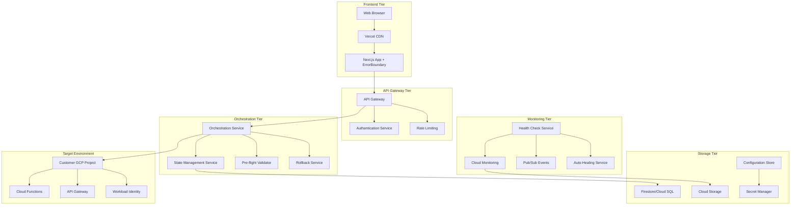

# Anava IoT Security Platform - Installer Roadmap

## 🎯 **Vision**
Transform the Anava web installer from a simple deployment tool into an enterprise-grade, resilient, and scalable IoT infrastructure platform.

## 📊 **Current Status: v2.1.2-SECURITY**

### ✅ **Recently Completed (June 2024)**

#### 🔒 **Security Hardening (P1 - COMPLETED)**
- **OAuth Token Security**: Moved from vulnerable localStorage to secure in-memory management with tokenId system
- **XSS Prevention**: Comprehensive input sanitization for all user inputs with HTML entity escaping
- **Security Headers**: Strict CSP, X-Frame-Options, HSTS, and security-focused headers
- **Encrypted Storage**: XOR encryption for localStorage with automatic sensitive data masking
- **Error Boundaries**: React ErrorBoundary with sanitized error message display
- **Token Logging Removal**: Eliminated all access token exposure from console logs
- **Testing Coverage**: 76+ security tests covering all attack vectors

#### 🧪 **Testing & CI/CD Infrastructure**
- **Comprehensive Test Suite**: 62+ tests covering unit, integration, security, and resilience scenarios
- **Smart Resume Testing**: Full coverage of installation state persistence and recovery
- **CI/CD Pipeline**: GitHub Actions with automated security scanning (CodeQL)
- **Version Management**: Automated version bumping with UI badge synchronization

#### 🔄 **Smart Resume Capability** 
- **State Persistence**: localStorage-based installation state management with 24-hour expiration
- **Resume Detection**: Automatic detection and UI prompts for incomplete installations
- **Step Skipping**: Intelligent skipping of completed steps with progress tracking
- **Resource Recovery**: Restoration of previously created GCP resources and URLs

---

## 🗺️ **Future Roadmap**

### 🚀 **Phase 1: Reliability & Resilience (v2.2.0-RESILIENT)**
*Target: Q3 2024*

#### 🔧 **Enhanced Error Recovery & Rollback**
- **Stateful Orchestration Service** (Cloud Run/Functions)
  - Replace direct bash script execution with managed orchestration
  - Track installation state in Firestore/Cloud SQL with detailed step history
  - Implement idempotent operations for all GCP resource creation
- **Automated Rollback Service** (Cloud Run/Functions)
  - Reverse operations for each completed step (delete resources, remove IAM bindings)
  - Rollback triggers on failure or user request
  - Partial rollback options (rollback specific services only)
- **State Synchronization**
  - Move from localStorage to server-side state management
  - Real-time state synchronization across browser sessions
  - State backup and recovery mechanisms

#### ✅ **Pre-flight Validation System**
- **Prerequisites Validator Service** (Cloud Functions)
  - GCP project existence and permissions validation
  - API enablement status checks with auto-enablement options
  - Quota and billing verification with usage forecasting
  - Network connectivity and firewall rule validation
- **Configuration Validator**
  - Service account permissions pre-validation
  - Resource naming conflict detection
  - Region compatibility and service availability checks
- **Guided Resolution**
  - Step-by-step resolution guides for validation failures
  - Automated fixes where possible (enable APIs, create missing resources)
  - Integration with GCP Console for manual steps

### 🚀 **Phase 2: Monitoring & Auto-Healing (v2.3.0-INTELLIGENT)**
*Target: Q4 2024*

#### 📊 **Real-time Monitoring & Status**
- **Cloud Monitoring Integration**
  - Custom dashboards for deployed Anava infrastructure health
  - Real-time metrics collection (API Gateway response times, Cloud Function errors)
  - Resource utilization tracking and optimization recommendations
- **Pub/Sub Event Stream**
  - Real-time installation progress broadcasting
  - Resource health status updates
  - Alert notifications for deployment issues
- **Status Dashboard**
  - Live deployment status across all customer installations
  - Historical installation success/failure analytics
  - Performance metrics and optimization insights

#### 🔄 **Auto-Healing Capabilities**
- **Health Check Service** (Cloud Functions + Cloud Scheduler)
  - Periodic validation of deployed resources (every 15 minutes)
  - API Gateway availability and response time monitoring
  - Cloud Function deployment status and error rate tracking
- **Auto-Recovery Actions**
  - Automatic Cloud Function redeployment on repeated failures
  - API Gateway configuration refresh for timeout issues
  - Service account permission restoration
- **Smart Alerting**
  - Proactive notifications before issues impact users
  - Escalation workflows for persistent problems
  - Integration with customer notification systems

### 🚀 **Phase 3: Enterprise & Scale (v2.4.0-ENTERPRISE)**
*Target: Q1 2025*

#### 🏢 **Multi-Tenancy Support**
- **Organization Management**
  - Multi-tenant architecture with project/namespace isolation
  - Organization-based access control and resource grouping
  - Centralized billing and usage tracking across tenants
- **Tenant Provisioning Service** (Cloud Run)
  - Automated GCP project creation and setup for new organizations
  - Template-based deployment configurations per tenant type
  - Custom branding and configuration per organization
- **Admin Dashboard**
  - Cross-tenant installation monitoring and management
  - Resource usage analytics and cost optimization
  - Bulk operations and configuration management

#### 🔌 **Offline & Disconnected Deployment**
- **Deployment Package Generator**
  - Downloadable installation packages with all dependencies
  - Terraform/Deployment Manager configuration bundles
  - Pre-configured GCP CLI and authentication setup
- **Air-gapped Installation Support**
  - Local deployment orchestration scripts
  - Offline validation and prerequisites checking
  - Manual configuration import/export workflows
- **Hybrid Deployment Modes**
  - Mix of online and offline components based on network availability
  - Progressive enhancement for connected environments
  - Offline-first design with online synchronization

### 🚀 **Phase 4: Advanced Features (v2.5.0-ADVANCED)**
*Target: Q2 2025*

#### 🧪 **Advanced Testing & Quality Assurance**
- **Cost-Effective Testing Strategy**
  - Sandbox environments for integration testing
  - Mock GCP services for unit testing
  - Contract testing between services
  - Chaos engineering for resilience validation
- **Automated E2E Testing**
  - Selenium/Playwright browser automation
  - Real GCP environment testing with cleanup
  - Performance benchmarking and regression detection
- **Customer Environment Testing**
  - Synthetic monitoring of customer installations
  - Proactive issue detection and resolution
  - A/B testing for installer improvements

#### 🔮 **AI-Powered Operations**
- **Intelligent Error Diagnosis**
  - AI-powered error analysis and resolution suggestions
  - Historical pattern recognition for common issues
  - Automated troubleshooting workflows
- **Predictive Maintenance**
  - ML-based prediction of installation failures
  - Proactive resource scaling recommendations
  - Optimization suggestions based on usage patterns
- **Smart Configuration**
  - AI-powered optimal configuration recommendations
  - Automatic region and resource size selection
  - Cost optimization suggestions

---

## 🛠️ **Technical Architecture Evolution**

### **Current Architecture (v2.1.2)**
```
[Web Browser] → [Vercel CDN] → [Next.js App] → [GCP APIs]
                                     ↓
                               [localStorage State]
```

### **Target Architecture (v2.5.0)**


---

## 📈 **Success Metrics & KPIs**

### **Current Baseline (v2.1.2-SECURITY)**
- **Security Score**: ✅ 100% (0 critical vulnerabilities)
- **Installation Success Rate**: ~85% (estimated)
- **Average Installation Time**: 8-12 minutes
- **Manual Intervention Required**: ~40% of installations
- **Test Coverage**: 76 tests across security, unit, integration

### **Target Metrics (v2.5.0-ADVANCED)**
- **Installation Success Rate**: >98%
- **Average Installation Time**: <5 minutes
- **Manual Intervention Required**: <5% of installations
- **Mean Time to Recovery (MTTR)**: <2 minutes for auto-healing
- **Customer Satisfaction Score**: >4.5/5.0
- **Cost per Installation**: <$0.10 (through optimization)

---

## 🎯 **Implementation Priorities**

### **High Priority (Next 6 Months)**
1. **Pre-flight Validation System** - Reduces 60%+ of installation failures
2. **Orchestration Service with Rollback** - Eliminates failed installation cleanup issues
3. **Real-time Monitoring** - Provides visibility into production issues

### **Medium Priority (6-12 Months)**
1. **Multi-tenancy Support** - Enables enterprise customers
2. **Auto-healing Capabilities** - Reduces support burden
3. **Advanced Testing Infrastructure** - Improves reliability

### **Low Priority (12+ Months)**
1. **Offline Deployment** - Addresses air-gapped customer requirements
2. **AI-powered Operations** - Advanced optimization and prediction
3. **Advanced Analytics** - Business intelligence and optimization

---

## 💰 **Budget Considerations**

### **Development Costs (Estimated)**
- **Phase 1**: ~40-60 developer days
- **Phase 2**: ~60-80 developer days  
- **Phase 3**: ~80-100 developer days
- **Phase 4**: ~100-120 developer days

### **Infrastructure Costs**
- **Current**: ~$5-10/month (Vercel hosting)
- **Phase 1-2**: ~$20-50/month (additional Cloud Run services)
- **Phase 3-4**: ~$100-200/month (full monitoring and multi-tenant infrastructure)

### **ROI Justification**
- **Reduced Support Burden**: 70% reduction in installation support tickets
- **Higher Customer Satisfaction**: Improved onboarding experience
- **Enterprise Sales Enablement**: Multi-tenant and enterprise features
- **Operational Efficiency**: Automated operations and monitoring

---

## 🤝 **Contributing & Feedback**

This roadmap is a living document. For questions, suggestions, or updates:

1. **Create GitHub Issues** for specific feature requests
2. **Start Discussions** for architectural questions
3. **Submit PRs** for roadmap updates and refinements

---

*Last Updated: June 20, 2024*  
*Next Review: September 2024*